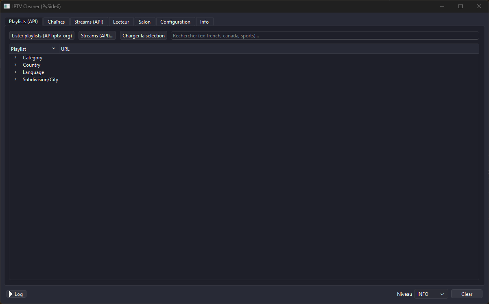
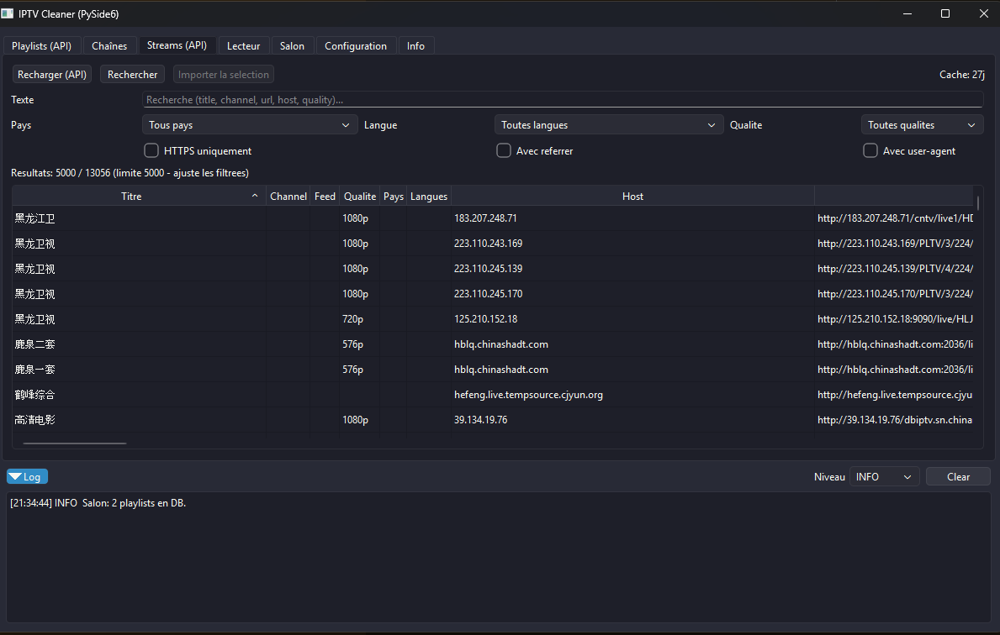
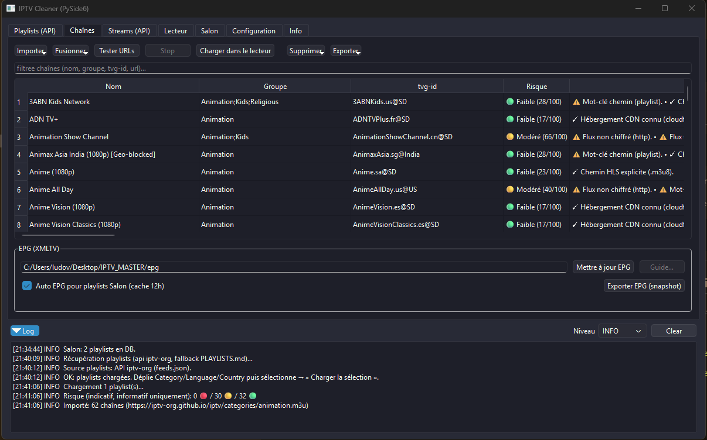
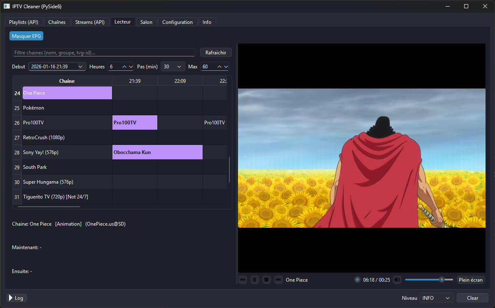
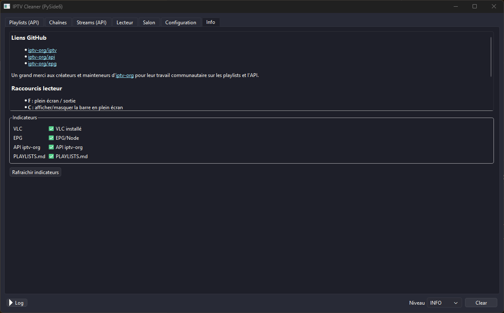

# 📺 IPTV Master

**IPTV Master** est une application de bureau moderne en **PySide6** pour explorer, nettoyer, analyser et lire des playlists IPTV.  
Elle permet de naviguer dans les playlists publiques iptv-org, d’assainir les flux, de tester leur accessibilité, d’intégrer un guide EPG et de lire les chaînes directement via **VLC intégré**.

Une vraie boîte à outils IPTV tout-en-un.

---

## ✨ Fonctionnalités principales

### 🔍 Exploration & Import
- **Browser GitHub iptv-org**
  - Télécharge automatiquement `PLAYLISTS.md`
  - Classe par **Catégorie / Langue / Pays / Ville**
  - Filtre par texte
  - Import multi-sources avec fusion automatique des M3U

- **Éditeur de playlists**
  - Import M3U depuis fichier ou URL
  - Recherche instantanée (nom, groupe, tvg-id, URL)
  - Suppression rapide (KO ou sélection)
  - Export M3U filtré
  - Export direct vers le Salon

---

### 🛡️ Analyse & Qualité
- **Scoring de risque (offline)**
  - Score 0–100 avec badge : **Faible / Modéré / Élevé**
  - Basé sur :
    - Type d’URL
    - TLD
    - IP brute
    - mots-clés
    - cohérence géographique
  - Tooltip détaillé par chaîne + résumé global

- **Test d’accessibilité des flux**
  - Probing parallèle (QThread + sous-processus)
  - Requêtes HEAD / GET
  - Timeouts courts
  - Statut en temps réel
  - Bouton Stop

---

### 📡 Guide TV (EPG)
- Support XMLTV (.xml ou .gz)
- Téléchargement automatique
- Parsing en streaming
- Stockage SQLite
- Affichage **Now / Next**
- Guide par chaîne (tvg-id)
- Guide intégré directement dans le lecteur

- **Pont npm iptv-org/epg**
  - Génère un XMLTV ciblé via `npm run grab`
  - Merge automatique
  - Matching intelligent des `tvg-id`
  - Sélection greedy des sources

---

### ▶️ Lecteur intégré (VLC)
- Player VLC embarqué (libVLC)
- Playlist filtrable
- Now / Next intégré
- Guide EPG repliable
- Double-clic depuis :
  - l’Éditeur
  - le Salon

---

### 🏠 Salon (bibliothèque locale)
- Stockage des playlists dans SQLite
- Recherche rapide
- Chargement direct dans le lecteur
- Ouverture dans l’éditeur
- Suppression via clic droit

---

### 🎨 Interface & Confort
- Thèmes dynamiques (`ui/themes/*.py`)
  - light / dark / ocean / forest / sunset / retro…
- Choix du style Qt
- Préférences persistées (`data/config.json`)
- Log repliable en bas de l’interface

---

## 🧱 Architecture rapide

```
app.py                  → point d’entrée
ui/main_window.py       → UI principale + logique centrale
core/m3u.py             → parsing / écriture M3U
core/risk_scoring.py    → heuristique de scoring
storage.py              → SQLite (playlists, chaînes, EPG)
epg_xmltv.py            → XMLTV download + parsing
epg_npm_bridge.py       → pont iptv-org/epg (npm)
imbed_vlc.py            → widgets VLC + lecteur
workers/probe_worker.py→ probes HTTP
salon_tab.py            → onglet Salon
ui/settings_tab.py      → configuration
ui/themes/              → thèmes UI
TESTS/                  → scripts & tests unitaires
```

---

## 📦 Prérequis

- Python **3.10+**
- VLC (libVLC utilisée par python-vlc)  
  👉 https://www.videolan.org/vlc/
- Node.js + npm *(optionnel, uniquement pour l’EPG iptv-org/epg)*
- Accès réseau (playlists, EPG, probes)

---

## ▶️ VLC / libVLC

Le lecteur intégré repose sur **libVLC** via `python-vlc`.

- Installe VLC : https://www.videolan.org/vlc/
- Relance l’application pour détecter libVLC
- Sans VLC, l’UI s’affiche mais la lecture ne démarre pas

---

## ⚙️ Installation

```bash
python -m venv .venv

# Windows
.\.venv\Scripts\activate

# Linux/macOS
source .venv/bin/activate

pip install -r requirements.txt
```

Pour l’EPG npm :
```bash
cd epg
npm install
```

---

## 🚀 Lancement

```bash
python app.py
```
Ou bien renommer en .pyw. Me meilleur reste Vscode 

La base SQLite est créée automatiquement dans :
```
data/iptv.db
```

---

## 🧭 Guide d’utilisation

### 1) Playlists (GitHub)
- Cliquer sur **Lister playlists**
- Filtrer
- Sélectionner Catégorie / Langue / Pays / Ville
- Cliquer **Charger la sélection**

### 2) Éditeur de chaînes
- Import M3U (fichier ou URL)
- Filtrer via recherche
- Tester URLs
- Supprimer KO ou sélection
- Export M3U ou Export vers Salon

### 3) EPG
- Entrer une URL XMLTV (.xml ou .gz)  
  **ou** un dossier `epg/` contenant `package.json`
- Cliquer **Mettre à jour EPG**
- Cliquer **Guide** sur une chaîne

### 4) Lecteur
- Onglet Lecteur
- Double-clic pour lire
- Now/Next et Guide si EPG présent

### 5) Salon
- Bibliothèque locale
- Double-clic pour lire
- Bouton pour ouvrir dans l’éditeur
- Suppression via menu ou bouton

### 6) Configuration
- Choix thème & style Qt
- Préférences persistantes
- Bouton Log pour journal

---

## Captures d'ecran






## 📡 EPG via iptv-org/epg (npm)

- Cloner https://github.com/iptv-org/epg dans `epg/`
- Lancer `npm install`
- Charger une playlist avec `tvg-id`
- Cliquer **Mettre à jour EPG**

Le bridge :
- Sélectionne automatiquement les bons sites
- Génère `custom.channels.xml`
- Merge le XMLTV final
- Corrige les suffixes `@SD/@HD`
- Limite les sources (max 12 par défaut)

Variable :
```
IPTV_EPG_MAX_SITES
```

---

## 🧪 Tests & debug

```bash
python -m pytest TESTS
```

---

## 🌍 Sources externes

- Playlists : https://github.com/iptv-org/iptv  
- API : https://github.com/iptv-org/api  
- Database : https://github.com/iptv-org/database  
- EPG : https://github.com/iptv-org/epg  

---

## 🙏 Crédits

- Projets **iptv-org** (iptv, api, database, epg)
- **VLC** & libVLC

---

## ℹ️ Notes

- Le scoring est purement informatif
- Les probes HTTP utilisent des sous-processus pour éviter les blocages
- Les assets volumineux sont exclus via `.gitignore`

